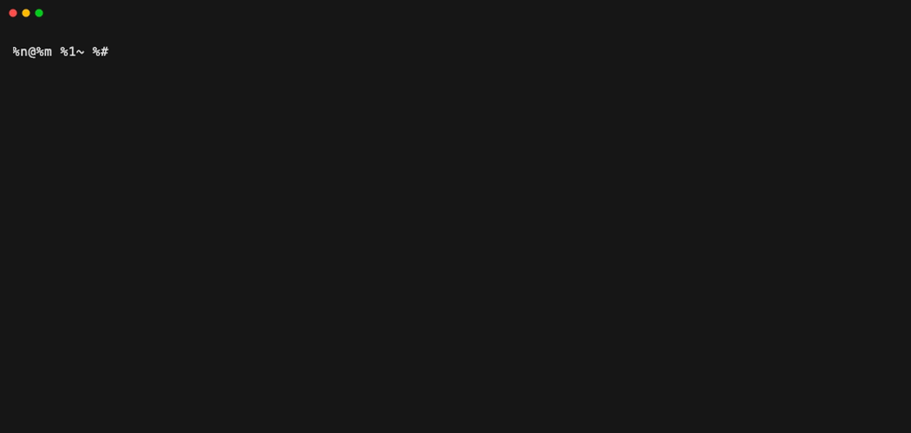

# Tasker: Lightweight CLI Task Tracking App



## Table of Contents

- [Overview](#overview)
- [Features](#features)
- [Installation](#installation)
- [Usage](#usage)
- [Data Model](#data-model)
- [Project Structure](#project-structure)
- [License](#license)

## Overview

Tasker is a simple, installable CLI application designed for managing your to-do list locally.

## Features

- Add, update, and delete tasks
- Mark tasks as 'todo', 'in-progress', or 'done'
- List all tasks or filter by status and date
- Persistent JSON-based storage
- Installable CLI (`tasker`)
- Clean CLI semantics

## Installation

```bash
pip install git+https://github.com/WuLandon/Task-Tracker-CLI.git
```

## Usage

```bash
tasker [--store PATH] <command> [options]

# Add
tasker add "Buy groceries"

# Update
tasker update 1 --status 'done' --description "Buy groceries and cook dinner"

# Delete
tasker delete 1

# Mark status
tasker mark-in-progress 1
tasker mark-done 1

# List
tasker list

# List filters
tasker list --task-id 1
tasker list --status 'todo'
tasker list --status 'in-progress'
tasker list --status 'done'
tasker list --date "<=2026-02-01"
```

Supported date operators: `=`, `<`, `>`, `<=`, `>=`.

## Data Model

Tasks are stored in a JSON file with the following structure:

```json
{
  "nextId": 3,
  "order": ["1", "2"],
  "tasks": {
    "1": {
      "description": "Buy groceries",
      "status": "todo",
      "createdAt": "2026-02-01T18:30:00",
      "updatedAt": "2026-02-01T18:30:00"
    }
  }
}
```

- `nextId` ensures unique task IDs
- `order` preserves insertion order
- `tasks` allows O(1) access by ID

## Project Structure

```
.
├── main.py          # CLI entry point
├── commands.py      # Command implementations
├── store.py         # JSON persistence & validation
├── models.py        # Typed data models
├── tests/           # Pytest test suite
├── pyproject.toml   # Packaging and tooling
└── README.md
```

## License

MIT
